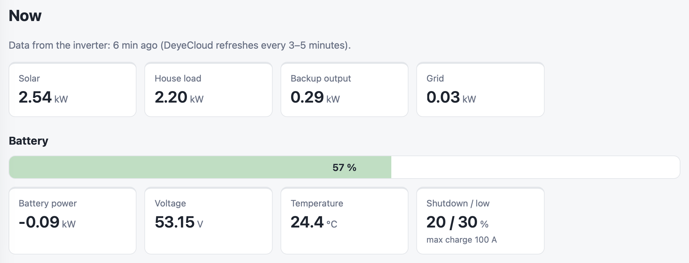
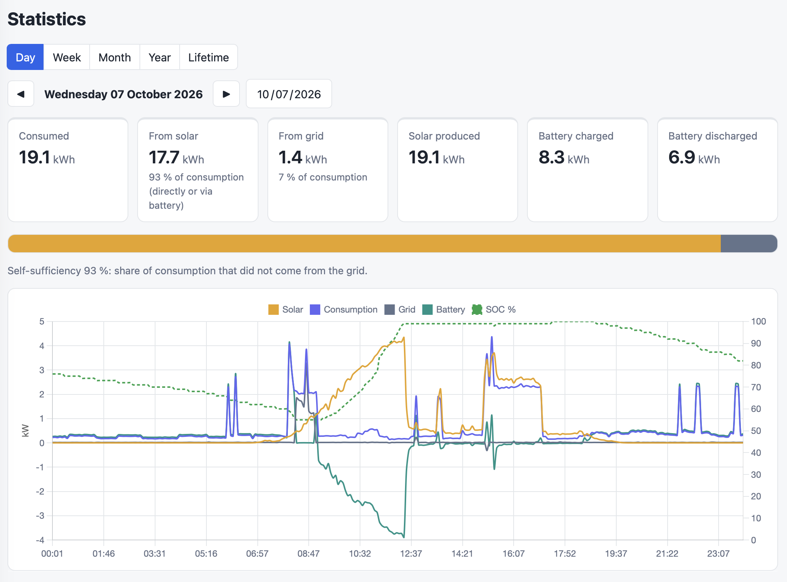
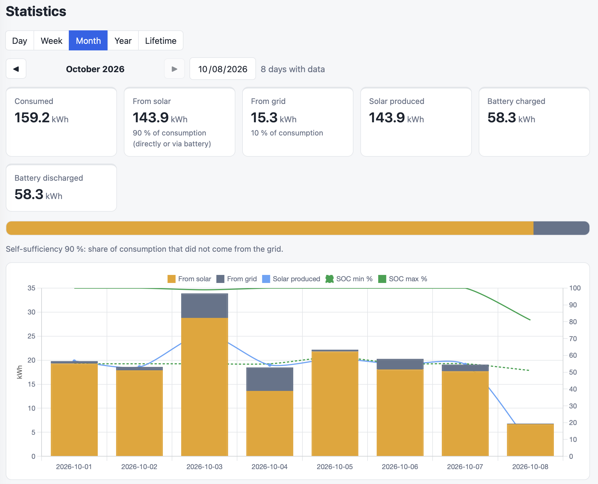
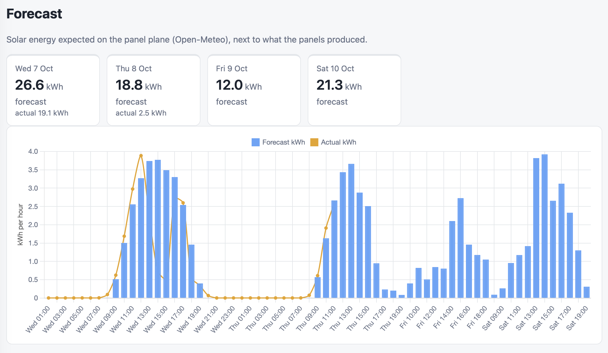
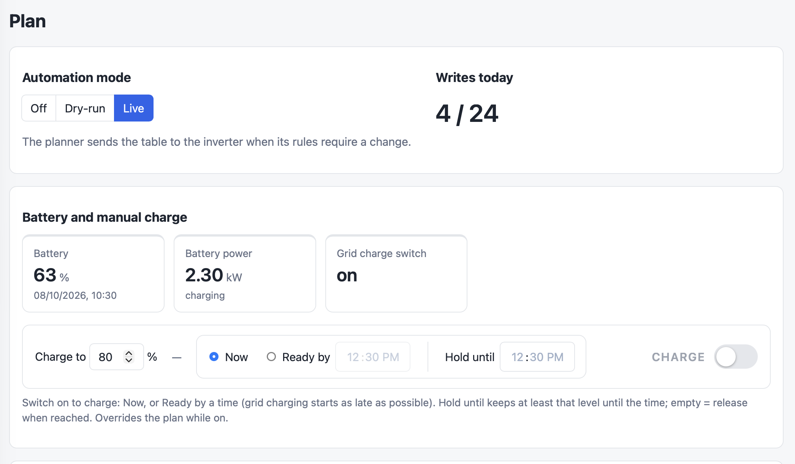
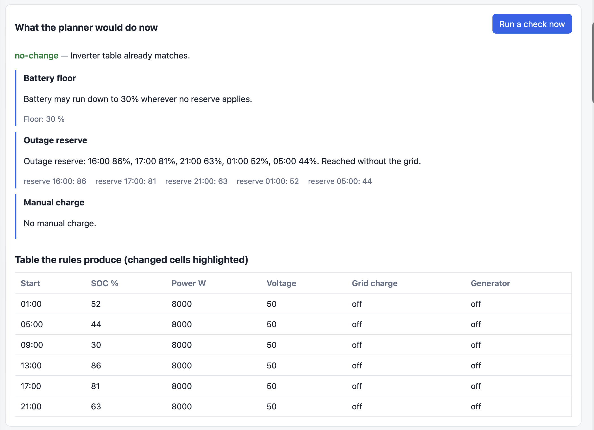
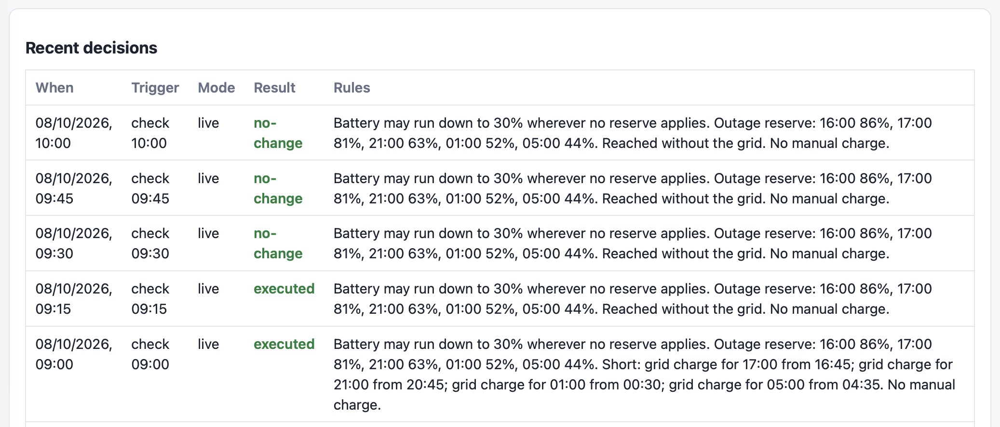

# deye-inverter

> **Built for personal use.** This is a home-lab tool for one particular Deye
> hybrid inverter, one battery and one roof. It is public because the approach
> may be useful to someone; it is not a product and has no support. It may
> change over time.

_**This was written with an AI agent, and it is meant to be read the same way.**
Take it as a starting point rather than as something to install. Your
installation is not this one: a different inverter firmware, battery, panel
layout, tariff and idea of what the battery is for. Point your own agent at this
repository and have it adapt the code to what you have. That is a good deal
faster than reading it all yourself, and it is how the code got here._

**A battery that is full enough when the grid fails, and is not filled from the
grid when the sun would have done it.**

That is the whole point. A Deye hybrid inverter decides how far the battery may
run down from its *Time of Use* table: six time slots, each with a minimum
state of charge and an optional "charge from the grid". A fixed table is wrong
most days: set high, it buys energy the panels would have delivered a few hours
later; set low, an evening outage finds the battery nearly empty.

deye-inverter checks that table every 15 minutes against a fresh weather
forecast and, through the DeyeCloud OpenAPI, rewrites it only when the rules
below ask for a different one:

- **Floor** — outside the protected hours the battery may run down to 30 %.
- **Outage reserve** — from 16:00 until the next morning each slot holds what a
  grid outage starting at that moment would need to last until the panels take
  over again. It is an hour-by-hour simulation: essential load only, half of
  the forecast sun, the battery never below its 20 % shutdown level.
- **Just in time** — when the sun will not get there, grid charging is planned
  as late as possible: the slot's start time is moved, and every later check
  moves it again or cancels it if the weather improves.
- **Manual charge** — "charge to X %", now or ready by a time, optionally held
  until a time. It overrides everything while it is on.

Every value behind a decision is a setting in the interface. The planner runs in
mode **Off**, **Dry-run** (decides and shows, sends nothing) or **Live**. Of
the 96 checks a day most end in "no change"; at most six of them may send a
new table. Each write is read back to confirm it.

Besides the planner it collects the inverter's live values every 5 minutes into
a local SQLite database, so the history stays readable without the cloud, and
shows statistics, the solar forecast (Open-Meteo, irradiance on the panel plane)
against actual production, and the Time of Use table, which can also be edited
and sent by hand.

## Where things are

| | |
|---|---|
| [How the planner works](docs/planner.md) | The rules in plain words, the outage simulation, just-in-time charging, a day from 09:00, and what the planner never does. |
| [Specification](docs/specification.md) | What the application does, the facts it relies on, every default, the architecture. |
| [Calibration](docs/calibration.md) | Comparing the forecast with actual production, and the panel settings derived from it. |
| [Deploy](docs/deploy.md) | Installing it as a systemd service on a Debian host. |
| [AGENTS.md](AGENTS.md) | The rules an AI agent working in this repository follows. |

## What it looks like



Live values as DeyeCloud last reported them: solar, house load, the backup
output, grid, and the battery with its shutdown and low limits.



One day: what was consumed, how much of it came from the sun (directly or
through the battery) and how much from the grid, with the power curves and the
battery's state of charge.



The same for a month, one bar per day, with the day's lowest and highest state
of charge.



The solar forecast for the next days, hour by hour, next to what the panels
actually produced.



The automation mode, the writes used today, and the manual charge: target,
now or ready by a time, hold until, and a switch.



What each rule decided at the last check, in words and figures, and the table
they produce together. Here the sun was expected to reach every reserve, so
nothing is bought from the grid.



Every check, what it decided and why. At 09:00 the forecast was poor and grid
charging was planned for the evening slots; by 09:15 the forecast had improved
and the grid charging was cancelled.

## Run

```bash
pip install .
cp config.example.toml <somewhere>/config.toml   # fill in the placeholders
DEYE_INVERTER_CONFIG=<somewhere>/config.toml python -m deye_inverter serve
```

Open `http://<host>:<port>/` and choose the password at the first visit. The
planner starts in Dry-run.

The credentials file holds four lines: `app_id=`, `app_secret=`, `email=`,
`password_sha256=` (SHA-256 of the DeyeCloud password). The DeyeCloud developer
application needs the permissions Station Monitoring, Device Monitoring and
Comission Control.

## Develop

```bash
pip install -e ".[dev]"
pytest            # tests with branch coverage (minimum 80 %)
ruff check src tests && ruff format --check src tests
mypy src
```

| Path | What |
|---|---|
| `src/deye_inverter/domain` | Time of Use table, readings, forecast, settings, planner rules, outage simulation — no I/O |
| `src/deye_inverter/application` | Use cases: collection, planner, manual charge, sending tables, statistics, scheduler |
| `src/deye_inverter/adapters` | DeyeCloud, Open-Meteo, SQLite, clock |
| `src/deye_inverter/ports.py` | Interfaces the application depends on |
| `src/deye_inverter/container.py` | Composition root |
| `src/deye_inverter/web` | FastAPI app, templates, CSS, JavaScript |
| `deploy/` | systemd unit and install script |

Chart.js 4.5.1 (MIT) is vendored in `web/static/vendor/` so the interface works
without a CDN.

## Licence

MIT. See `LICENSE`.

## Origin

This project was designed iteratively as a human–AI collaboration: human intent,
architecture, review and on-site validation combined with AI-assisted
investigation and implementation.
